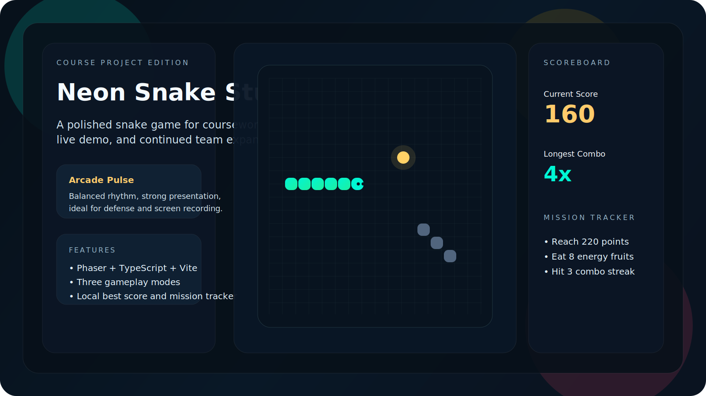
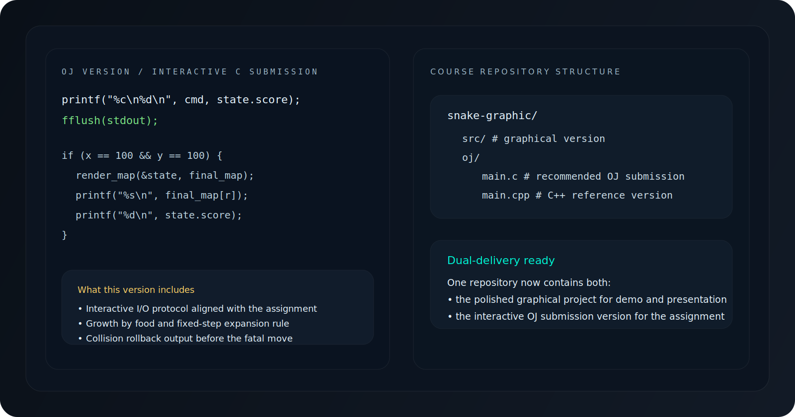

# Neon Snake Studio

一个为课程大作业准备的高完成度贪吃蛇项目仓库，目前同时包含两个版本：

- 图形化版本：基于 `Vite + TypeScript + Phaser`
- OJ 版本：用于交互式评测提交

这个仓库的目标不是只做“能跑”，而是尽量做到：

- 适合课程答辩展示
- 适合直接提交 OJ
- 适合后续继续扩展成更完整的小组项目



## 仓库内容

### 1. 图形化版本

图形化版本位于仓库根目录，重点是完整的演示体验和视觉表现：

- 单人贪吃蛇玩法
- 实时记分与本地最高分记录
- 固定障碍、边界碰撞、食物生成、被动增长机制
- 三种模式：`Zen Bloom`、`Arcade Pulse`、`Inferno Grid`
- 响应式 HUD、暂停、重开、局后总结、任务追踪
- 键盘、触屏按钮、滑动操作、全屏展示支持
- 设置持久化：模式、动效、音效会自动保存在本地

技术栈：

- `Vite`
- `TypeScript`
- `Phaser 3`
- DOM HUD + 自定义 CSS 视觉系统

### 2. OJ 版本

OJ 版本位于 [`oj/`](./oj) 目录，包含：

- [`oj/main.c`](./oj/main.c)：推荐提交的 C 语言版本
- [`oj/main.cpp`](./oj/main.cpp)：保留的 C++ 参考版本
- [`oj/README.md`](./oj/README.md)：OJ 版本说明

它已经按题目要求处理了交互逻辑：

- 每轮先输出移动方向与移动前分数
- 每轮输出后调用 `fflush(stdout)`
- 收到 `100 100` 后输出碰撞前地图和当前得分



## 图形化版本亮点

- 霓虹网格主战场
- 分层玻璃态 HUD
- 粒子爆发与镜头反馈
- 模式切换带来的不同节奏体验
- 移动端方向盘 + 滑动控制
- 更适合录屏和课堂展示的整体气质

## 项目结构

```text
snake-graphic/
  src/                    # 图形化版本源码
  oj/                     # OJ / 控制台版本
  docs/
    images/               # GitHub 展示图
```

## 本地运行图形化版本

```bash
pnpm install
pnpm dev
```

执行后打开终端里显示的本地地址即可。

## 生产构建

```bash
pnpm build
```

构建产物会输出到 `dist/`。

## 图形化版本操作说明

- `W A S D` 或方向键：控制移动
- `Space` / `P`：暂停或继续
- `F`：切换全屏展示
- 移动端：支持按钮点击和滑动输入

## 课程使用建议

- 用仓库根目录项目做图形化展示
- 用 `oj/main.c` 做 OJ 提交
- 课堂展示优先推荐 `Arcade Pulse`
- 想突出视觉冲击可以切到 `Inferno Grid`
- 想展示更稳的长线推进感可以用 `Zen Bloom`

## 我认为后续还可以继续优化的方向

如果继续打磨，这个项目还有几条很值得做的升级路线：

- 加入排行榜与历史对局记录
- 增加自定义地图和障碍布局编辑
- 做双人对战或接力模式
- 增加音效包与背景音乐
- 做回放系统，方便答辩展示“最佳一局”
- 为 OJ 版本补一个本地 judge 模拟器
- 给图形化版本加成就系统和更多任务目标

## 当前已经额外完善的内容

这次在原有基础上，我又继续补了几项实用改进：

- 仓库首页改为更适合 GitHub 展示的结构
- 补入 OJ 版本源码与说明
- 增加展示图资源
- 图形化版本增加设置持久化
- 图形化版本增加移动端滑动控制
- 图形化版本增加全屏展示支持
