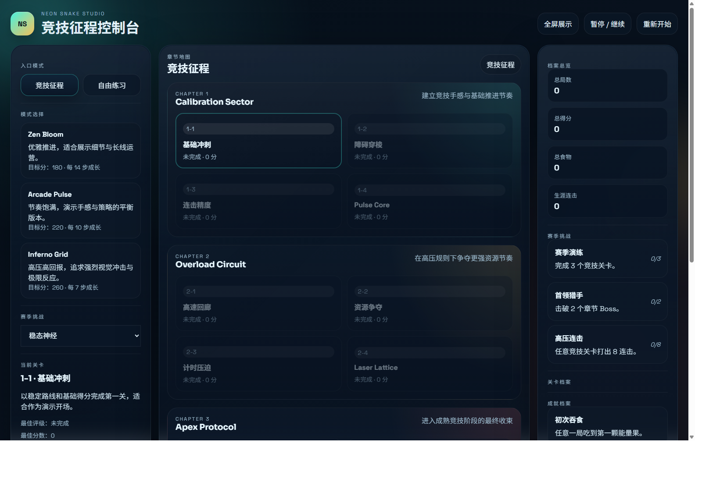

# Neon Snake Studio

一个面向课程大作业展示、同时具备持续游玩价值的贪吃蛇项目仓库。

当前仓库包含两个版本：

- 图形化版本：基于 `Vite + TypeScript + Phaser`
- OJ 版本：基于 `C`，用于交互式评测提交

这次版本升级后，图形化部分已经从“可演示的作品原型”进一步推进到“**单机竞技闯关版贪吃蛇**”：

- 保留 `Zen / Arcade / Inferno` 三种自由练习模式
- 新增 `竞技征程`，包含 3 个章节、12 个固定关卡
- 加入章节 Boss、关卡目标、评级系统、赛后复盘与回放功能
- 界面升级为“左侧指挥台 + 中央章节地图/战场 + 右侧情报面板”的完整产品化布局



## 项目亮点

### 1. 竞技征程

竞技征程是当前版本的主打内容，共 3 个章节、12 个关卡：

- 第一章 `Calibration Sector`
  - 1-1 基础冲刺
  - 1-2 障碍穿梭
  - 1-3 连击精度
  - 1-4 Boss `Pulse Core`
- 第二章 `Overload Circuit`
  - 2-1 高速回廊
  - 2-2 资源争夺
  - 2-3 计时压迫
  - 2-4 Boss `Laser Lattice`
- 第三章 `Apex Protocol`
  - 3-1 极限增殖
  - 3-2 复杂迷宫
  - 3-3 炼狱试炼
  - 3-4 Final Boss `Gravity Knot`

每关都带有：

- 主目标
- 次目标
- 失败条件
- `Bronze / Silver / Gold / S` 四档评级

### 2. Boss 机制

当前版本包含 3 种章节 Boss 表现：

- `Pulse Core`：十字电场型 Boss，带预警与转场
- `Laser Lattice`：整行整列扫线型 Boss
- `Gravity Knot`：安全区收缩型 Boss

Boss 不再只是随机障碍，而是关卡化脚本机制，会影响路线、节奏和复盘价值。

### 3. 回放与赛后分析

图形化版本已经加入三档回放能力：

- 本局回放
- 本关最佳回放
- 最后 10 秒高光回放

同时结果页会给出：

- 关卡评级
- 本局得分、食物数、连击数、Boss 命中次数
- 路径热区图
- 关键事件时间线


### 4. 自由练习模式

除了竞技征程，依旧保留自由练习模式，适合：

- 课堂演示基础玩法
- 单独刷分
- 测试速度节奏
- 演示 UI、Boss 与回放系统

模式包括：

- `Zen Bloom`
- `Arcade Pulse`
- `Inferno Grid`

### 5. 长线目标系统

当前版本还整合了：

- 成就系统
- 生涯统计
- 赛季挑战
- 章节进度持久化
- 每关最佳成绩与最佳评级记录

## 仓库结构

```text
snake-graphic/
  src/                    # 图形化版本源码
  oj/                     # OJ / 控制台版本
  docs/
    images/               # GitHub 展示截图
```

## 图形化版本运行方式

```bash
pnpm install
pnpm dev
```

构建生产版本：

```bash
pnpm build
```

## 图形化版本操作说明

- `W A S D` 或方向键：控制方向
- `Space` / `P`：暂停或继续
- `F`：切换全屏
- 移动端：支持方向按钮和滑动输入

## OJ 版本说明

OJ 版本位于 [`oj/`](./oj) 目录，主要文件包括：

- [`oj/main.c`](./oj/main.c)：推荐提交的 C 语言版本
- [`oj/main.cpp`](./oj/main.cpp)：保留的 C++ 参考版本
- [`oj/README.md`](./oj/README.md)：OJ 版本说明

已经按题目要求处理了交互逻辑：

- 每轮先输出移动方向与移动前分数
- 每轮输出后调用 `fflush(stdout)`
- 收到 `100 100` 后输出碰撞前地图和当前得分

## 这次成熟化升级的核心内容

本轮重点升级内容包括：

- 新增竞技征程、章节地图与关卡选择
- 引入固定关卡数据与进度存储
- 新增章节 Boss 机制
- 新增目标系统、评级系统与赛季挑战
- 新增本局回放 / 最佳回放 / 高光回放
- 新增赛后分析面板与路径热区展示
- 重构图形化版本主界面布局与 HUD

## 后续仍值得继续扩展的方向

如果继续打磨，这个项目还很适合往下发展：

- 关卡编辑器
- 更多 Boss 与章节主题
- 自定义音效包与背景音乐
- 本地排行榜与挑战赛模式
- 更丰富的赛后数据分析
- 双人合作或对战模式

## 使用建议

- 课程展示优先推荐 `竞技征程`
- 想快速演示基础玩法可用 `Arcade Pulse`
- 想突出高压效果可以直接切到 `Inferno Grid`
- OJ 提交请使用 `oj/main.c`
